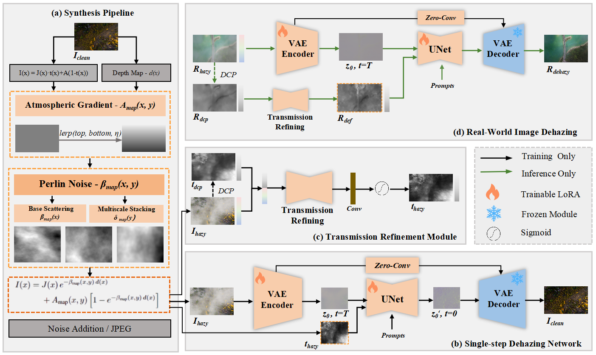

# UAV-Dehazing: UAV-Dehazing: A Real-World Non-Homogeneous Aerial Dehazing Benchmark with a Physics-Aware Single-Step Diffusion Network

[](#)
[](https://antit-pixel.github.io/-UAV-Dehazing/)
[](#dataset)
[](#)
[](LICENSE)

> Aerial-view dehazing is critical for drone photography and other aerial operations, yet most current approaches are developed for ground-level scenes and therefore underperform on aerial haze due to the lack of dedicated synthesis pipelines and tailored algorithms. To bridge this gap, we propose a realistic and robust aerial-haze synthesis pipeline and, building on this, a specialized dehazing model termed PSSD. Our contributions are threefold: (1) Data: We establish UAV-Haze, the first drone-view haze dataset, which consists of 9,412 clean high-resolution aerial images and 997 real hazy aerial images captured by drones. 
(2) Synthesis: We pioneer an inhomogeneous haze synthesis pipeline for drone imagery that accurately generates the spatial variation of aerial haze, abandoning the oversimplified homogeneous assumptions prevalent in prior work. (3) We designe a single-step diffusion network (PSSD) that integrates a physics-aware refinement module to obtain refined physical prior information, guiding the model to achieve end-to-end single-step image dehazing.

<p align="center">
  
</p>

## ✨ Highlights


## 📦 Environment
```bash
conda create -n uavdehaze python=3.10 -y
conda activate uavdehaze
pip install -r requirements.txt
